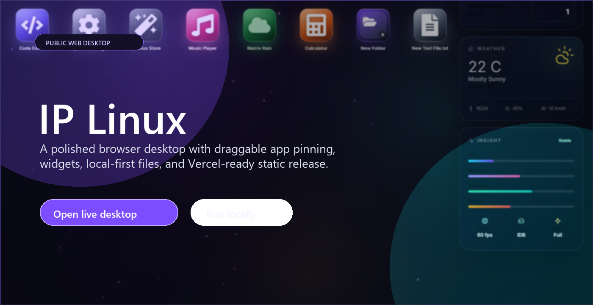
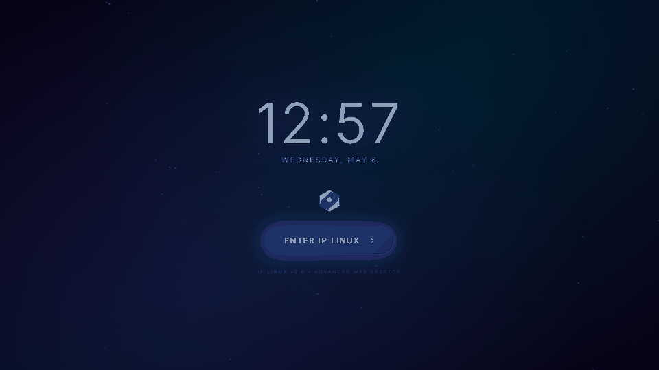
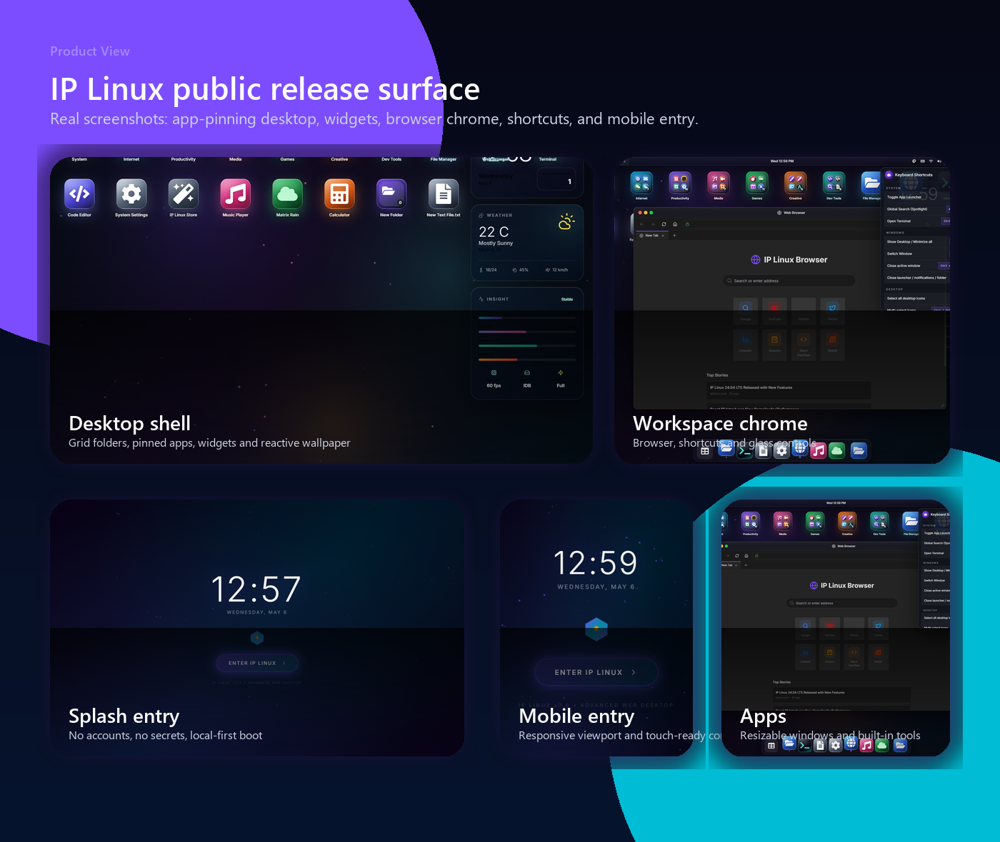
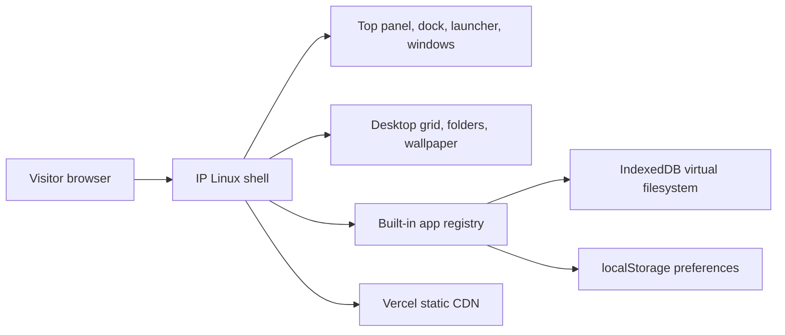

# IP Linux

<p align="center">
  <a href="https://ip-os-linux.vercel.app"><strong>ip-os-linux web</strong></a>
  · <a href="#run-locally">Run Locally</a>
  · <a href="#accessibility-and-quality">Accessibility</a>
  · <a href="#architecture">Architecture</a>
  · <a href="SECURITY.md">Security</a>
</p>

<p align="center">
  
  
  
  
  
  
</p>

IP Linux is a public, local-first browser desktop: a polished operating-system style shell with glass UI, resizable windows, desktop folders, virtual workspaces, a dock, launcher, reactive wallpapers, and built-in apps. It is designed to feel like a product-grade web desktop while remaining safe to publish and trivial to deploy on Vercel.



## Preview





## Highlights

- Premium browser desktop with top panel, dock, launcher, desktop folders, strict icon grid, virtual workspaces, snap assist, and resizable windows.
- Drag apps from the launcher to the desktop, or use the inline `+` control to pin more shortcuts without disturbing the existing grid.
- Local-first app surface: Files, Terminal, Browser, Music, Matrix Rain, Settings, Store, games, productivity tools, and developer utilities run in the visitor's browser.
- Desktop widgets for local time, weather, workspace state, system insight, render status and local storage posture.
- Responsive shell for desktop, tablet, mobile, 1080p, 2K and 4K viewports with no fixed-scale lockout.
- Reactive wallpaper layer, acrylic glass, motion controls, reduced-motion support, and screen effect preferences.
- Browser fallback that handles embeddable YouTube URLs and gives a clear blocked-site state for sites that refuse iframes.
- Public-safe deployment posture: no OpenAI, Supabase, Cloud Sync, backend service, or secret environment requirement in this release.
- Repository presentation media is generated from the deployed app so the README matches the real product.

## Tech Stack

| Layer | Tools |
| --- | --- |
| App shell | React 19, TypeScript, Vite |
| Styling | Tailwind CSS, CSS custom properties, glass/acrylic utility classes |
| UI primitives | Radix UI, Lucide, curated vector icons |
| Local storage | IndexedDB via `idb-keyval`, browser `localStorage` for UI preferences |
| App chrome | Window manager, dock, launcher, top panel, contextual menus |
| Security | DOMPurify, CSP headers, restrictive permissions policy |
| Deployment | Vercel static hosting from `app/dist` |
| Documentation media | `.github/assets/` screenshots, hero, bento and preview GIF |

## Architecture



```text
app/
  src/apps/          Built-in desktop applications
  src/components/    Shell, dock, launcher, windows, menus
  src/hooks/         OS store and filesystem hooks
  src/lib/           Layout, storage, effects, helpers
  public/            Manifest, sitemap, robots, public assets
.github/assets/      README screenshots, GIF and social preview material
docs/                Public release and accessibility governance notes
SECURITY.md          Public security model
vercel.json          Build, routing and production security headers
```

## Run Locally

```powershell
git clone https://github.com/ikerperez12/IP-OS-LINUX.git
cd IP-OS-LINUX\app
npm ci
npm run dev
```

Open `http://localhost:3000/` or the local URL printed by Vite.

The app is fully static. There is no backend boot sequence, no database service, and no secret environment variable requirement for local preview.

## Quality Gates

```powershell
cd app
npm run lint -- --quiet
npm audit --audit-level=high
npm run build
```

The production bundle is emitted to `app/dist`. CI runs the same public release checks on `main`.

## Accessibility And Quality

IP Linux is a visual desktop simulation, but the public release keeps an accessibility baseline:

- Accessible names on critical icon-only controls in the dock, launcher, top panel, windows, shortcuts panel and store.
- Keyboard-friendly global shortcuts that do not hijack inputs, terminals or editable app surfaces.
- Responsive viewport settings that allow browser zoom and avoid disabling user scaling.
- Reduced-motion support for decorative movement and background effects.
- Focus-visible treatment on interactive chrome and app controls.
- Semantic release documentation, landmarks in the rendered app, and user-visible fallbacks for blocked browser content.

More detail is tracked in [docs/public-release-playbook.md](docs/public-release-playbook.md).

## Security And Public Release Posture

- No active OpenAI, Supabase, Cloud Sync or server-side service is included in this release.
- No real secrets are needed. `.env`, private keys, Vercel local config and generated builds are ignored.
- User files and preferences remain in the visitor's browser through IndexedDB/localStorage.
- Dynamic HTML preview surfaces are sanitized with DOMPurify.
- Vercel response headers define CSP, HSTS, MIME hardening, referrer policy, permissions policy and frame blocking.

See [SECURITY.md](SECURITY.md) before adding any cloud integration or third-party iframe origin.

## Production Notes

- Live URL: [https://ip-os-linux.vercel.app](https://ip-os-linux.vercel.app)
- Deployment target: Vercel static site from `app/dist`
- Build command: `npm ci --prefix app && npm run build --prefix app`
- Runtime assets: `app/public/`, generated JS/CSS chunks, and README media under `.github/assets/`
- Metadata: canonical URL, social preview tags, manifest, robots and sitemap ship from `app/`

## Repository Status

This repository is shaped as a clean public product surface: buildable from a fresh clone, documented, static-only, deployable as-is, and free from internal environment coupling. IP Linux is not a native Linux distribution and does not execute native binaries; it is a browser-based desktop environment and app playground.
