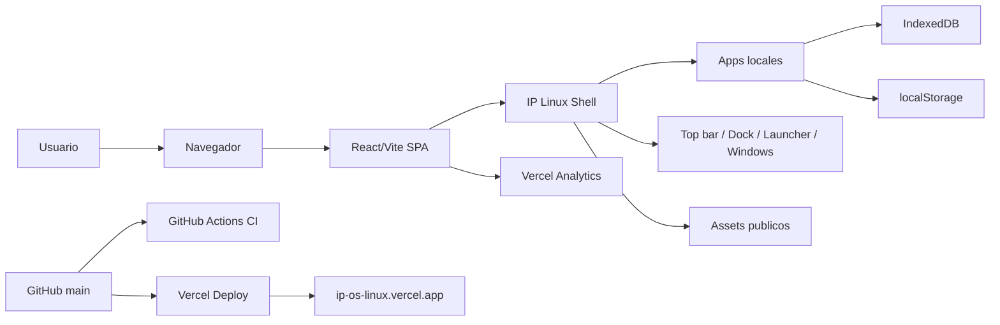

# Memoria tecnica completa: IP Linux

Documento generado como auditoria tecnica, memoria de producto y base para playbook profesional de implementacion web.

Fecha de auditoria local: 2026-05-08.  
Ruta inspeccionada: `C:\PROYECTOS\IDEAS\LINUX`.  
Regla de seguridad aplicada: no se reproducen secretos, tokens, cookies, valores reales de `.env`, ids internos sensibles ni correos privados. Cuando una evidencia contiene ids o valores sensibles, se documenta como `<REDACTED>`.

## 1. Resumen ejecutivo

IP Linux es un escritorio web local-first construido con React, TypeScript y Vite. El producto simula una experiencia de sistema operativo dentro del navegador: splash de entrada, escritorio con iconos y carpetas, dock, launcher, top bar, ventanas redimensionables, apps internas, wallpapers reactivos, widgets, busqueda global, workspaces virtuales y persistencia local en el navegador.

El problema que resuelve no es reemplazar un sistema operativo real, sino ofrecer una demo publica de alto impacto y una superficie de producto para explorar patrones de UI avanzada: ventanas, chrome de escritorio, apps embebidas, glass UI, responsive, accesibilidad por defecto, seguridad de publicacion, documentacion profesional y despliegue estatico en Vercel. El repositorio esta preparado como producto publico, no como plantilla Vite generica.

Estado final verificado:

- URL publica: `https://ip-os-linux.vercel.app`.
- Repositorio GitHub: `https://github.com/ikerperez12/IP-OS-LINUX`.
- Visibilidad GitHub: publica.
- Rama principal: `main`.
- Deploy Vercel: `Ready`, target `production`.
- CI GitHub Actions: ultimo flujo revisado en `main` con conclusion `success`.
- Build local tras instalacion limpia: correcto.
- Lint local: correcto.
- `npm audit --audit-level=high`: sin vulnerabilidades.
- Backend propio: No encontrado.
- Variables obligatorias de entorno: No encontrado.
- Cloud Sync / OpenAI / Supabase activos: No encontrado.

Stack principal verificado:

- React 19.
- TypeScript.
- Vite 7.
- Tailwind CSS.
- Radix UI primitives.
- Lucide React, React Icons y `@react-icons/all-files`.
- DOMPurify.
- IndexedDB via `idb-keyval`.
- Vercel static hosting.
- Vercel Web Analytics instalado en codigo con `@vercel/analytics`.

Nivel de madurez: demo publica / release estatico usable. No debe presentarse como produccion transaccional con backend, porque no tiene servidor, autenticacion real, base de datos remota, observabilidad de errores, tests E2E completos ni contratos de datos externos. Si se evalua como producto web estatico, esta en estado release publico: repo presentable, README con media, licencia MIT, seguridad documentada, CI, Vercel y URL live.

Importancia para el proceso: este proyecto condensa un flujo reutilizable de publicacion profesional: estabilizar antes de ampliar, separar funcionalidades de documentacion, eliminar features muertas, evitar secretos en frontend, convertir README en pagina de producto, capturar assets reales, configurar headers de seguridad, correr gates locales, verificar CI, desplegar via Vercel y dejar un playbook de release.

## 2. Evidencia revisada

| Evidencia | Ruta / fuente | Que aporta | Estado |
| --- | --- | --- | --- |
| Directorio de trabajo | `C:\PROYECTOS\IDEAS\LINUX` | Raiz local del repo auditado | Verificado |
| Estado Git | `git status --short --branch` | `main...origin/main`, sin cambios al iniciar documentacion | Verificado |
| Remote Git | `git remote -v` | `https://github.com/ikerperez12/IP-OS-LINUX.git` | Verificado |
| Historial Git | `git log --date=short --pretty=format:'%h %ad %s' --max-count=60` | Evolucion por commits desde initial commit hasta Web Analytics | Verificado |
| Tags | `git tag --sort=-creatordate` | No hay tags visibles | No encontrado |
| README raiz | `README.md` | Presentacion publica, live URL, stack, arquitectura, quick start, seguridad | Verificado |
| README app | `app/README.md` | Instrucciones breves para app React/Vite | Verificado |
| Security policy | `SECURITY.md` | Modelo de seguridad cliente, secretos, storage, DOMPurify, headers recomendados | Verificado |
| Licencia | `LICENSE` | MIT License | Verificado |
| Package app | `app/package.json` | Scripts, dependencias, devDependencies | Verificado |
| Lock npm | `app/package-lock.json` | Lockfile npm; usado por CI y Vercel | Verificado |
| pnpm/yarn | `pnpm-lock.yaml`, `yarn.lock` | Lockfiles alternativos | No encontrado |
| Python | `requirements.txt`, `pyproject.toml` | Backend o tooling Python | No encontrado |
| Env example | `app/.env.example` | Declara que no hay envs obligatorias y advierte sobre `VITE_*` | Verificado |
| Gitignore raiz | `.gitignore` | Ignora `.env`, `.vercel`, build outputs, node_modules, secretos | Verificado |
| Gitignore app | `app/.gitignore` | Existe; contenido no analizado en profundidad en esta auditoria | Verificado parcialmente |
| Vercel config | `vercel.json` | Build command, output directory, rewrites, CSP y headers | Verificado |
| Vite config | `app/vite.config.ts` | Vite React, alias `@`, manual chunks, server port 3000 | Verificado |
| Tailwind config | `app/tailwind.config.js` | Tokens via CSS vars, radius, shadows, animations | Verificado |
| ESLint config | `app/eslint.config.js` | TypeScript ESLint, react hooks, react refresh, reglas relajadas | Verificado |
| CI workflow | `.github/workflows/ci.yml` | `npm ci`, audit high, lint, build en Node 22 | Verificado |
| Docs | `docs/public-release-playbook.md` | Contrato de release publico, README pattern, media, a11y, security, Vercel | Verificado |
| Public assets | `app/public/*` | icon, manifest, robots, sitemap, OG image, wallpaper | Verificado |
| README assets | `.github/assets/*` | Hero, desktop, mobile, bento, GIF preview, splash | Verificado |
| Source app | `app/src/*` | Componentes, apps, hooks, lib, tipos | Verificado |
| Tests propios | `tests/*`, `*.test.*`, `*.spec.*` fuera de `node_modules` | No hay suite propia detectada | No encontrado |
| Vercel local link | `.vercel/project.json` | Proyecto linkado; ids redactados | Verificado, valores `<REDACTED>` |
| Vercel deploy | `vercel inspect https://ip-os-linux.vercel.app --scope <REDACTED>` | Deploy production Ready y aliases live | Verificado |
| GitHub repo metadata | `gh repo view` | Repo publico, MIT, homepage, topics, default branch | Verificado |
| PRs GitHub | `gh pr list --state all` | PR #1 y PR #2 merged | Verificado |
| Issues GitHub | `gh issue list --state all` | Lista vacia | No encontrado |
| Branch protection | `gh api .../branches/main/protection` | HTTP 404 branch not protected | No encontrado |
| Checks locales | `npm run build`, `npm run lint -- --quiet`, `npm audit --audit-level=high` | Build/lint/audit actuales pasan | Verificado |
| Secret scan | `git grep -nE ...` | Solo coincidencias en documentacion y `.env.example`; sin secretos reales detectados | Verificado |
| Conversacion actual | Contexto del hilo de trabajo | Roadmap, decisiones, bugs, deploy, cambios de direccion | Verificado parcialmente |

## 3. Historia del proyecto en la conversacion

| Fecha / fase | Que paso | Decision | Resultado | Evidencia |
| --- | --- | --- | --- | --- |
| 2026-05-03 / inicio | Se creo el proyecto como app React/Vite con experiencia de escritorio IP Linux | Arrancar como SPA de escritorio web | Primer commit `c918634 Initial commit` | `git log` |
| Ronda visual inicial | Se pidieron mejoras visuales hiper-realistas: sombras, acrylic, magic lamp, particulas, reflejos | Priorizar primero impacto visual y bugs visibles | Se fueron incorporando iconos, dock, wallpaper, ventanas, top bar | Conversacion; commits 2026-05-04/05 |
| Correccion de build | Aparecieron errores de TypeScript por template literal no cerrado y restos de codigo en `AppLauncher.tsx`/`MatrixRain.tsx` | Reparar sintaxis antes de seguir | Build volvio a compilar | Conversacion; builds previos |
| Ronda 3 | Plan de Visual Premium, bugs y base OpenAI/Supabase segura | Preparar base pero no exponer claves | Iconos premium, SystemIcon, wallpaper, MusicPlayer, MatrixRain, lazy loading, DOMPurify, safeMath | Commits `a92dd27`, `323c0c9`, `717a473`, `f32ed7a`, `b476848` |
| Ronda 4 | Se pidio grid de escritorio, carpetas glass, fondos, browser, YouTube, top bar funcional | Implementar limites reales de iframe y ordenar desktop | Grid engine, carpetas, wallpaper unificado, YouTube Lite, controles acrylic | Commits `86a3402`, `41e358e`, `763b38c`, `e167d55`, `8bbdc50` |
| Cambio de alcance | Usuario pidio quitar barra flotante de tareas abiertas | Mantener solo dock principal | OpenTasksBar dejo de montarse; luego se retiro como dead code | Commit `b90d401`, `ab9adfa` |
| Limpieza Cloud/AI | Usuario pregunto si Cloud Sync y AI Bridge servian | Si eran decorativos/dead code, eliminarlos | Servicios AI/Supabase y estado integration removidos; Ronda 8 IA eliminada | `1a24a62`, `ab9adfa`; README/SECURITY |
| Atajos molestos | Usuario pidio quitar interferencia de Tab/seleccion en Terminal/CMD | No capturar atajos globales dentro de inputs/contenteditable | Ctrl+W movido a Ctrl+Shift+W; handlers ignoran targets editables | `62b58b7`; `app/src/App.tsx`, `GlobalSearch.tsx` |
| Robot shortcuts | Usuario pidio icono flotante robot con todos los shortcuts | Anadir panel en top bar | Boton robot y panel de shortcuts | `c5575d2`; `TopPanel.tsx` |
| Rondas 6/7 | Usuario pidio avanzar con visual sensorial y productividad OS, luego cancelo IA | Hacer 6,7,9,10; excluir Ronda 8 | Filtros pantalla, acrylic grain, audio visualizer, dynamic shadows, wobbly, workspaces, clipboard, snap assist | `0c0d77e`, `a2a4868` |
| Ronda 9 parcial | App Store y Terminal tabs | Centralizar disabled apps, proteger apps core, tabs accesibles | Store funcional y terminal tabs | `7c1a50a`, `191d16d` |
| Seguridad publica | Usuario pregunto si era seguro publicar | Hacer auditoria y endurecer repo | `.gitignore`, `SECURITY.md`, no secretos, password demo memory-only | `87107b5`, `8e0ff22` |
| Release publico | Usuario pidio repo publico y Vercel | Crear rama `cx/public-release-vercel`, PR y merge | PR #1 merged; CI; Vercel production | PR #1; commits `0483add`, `a03ad28`, `2a6854c`, merge `9e37841` |
| Fix responsive/windows | Se detectaron problemas en resize y viewports compactos | Restaurar resize y mejorar default sizing | Ventanas redimensionables y viewport compacto mas estable | `a6dd20d`, `031fdbc` |
| Presentacion publica | Usuario pidio README tipo UI IP Toolkit con capturas | README producto, assets reales, OG image, docs | Hero, GIF, bento, metadata, playbook | `ba352b2`; `.github/assets`, `docs/public-release-playbook.md` |
| Desktop final | Usuario pidio mas apps al desktop, pin desde launcher, widgets, create file/folder | Anadir pin con `+`, drag al desktop, widgets, fix context menu | `New Folder`, `New Text File`, pinning y widgets verificados en codigo | `efbb5d9` |
| Vercel Analytics | PR automatico de Vercel | Instalar Web Analytics | `@vercel/analytics` y `<Analytics />` en `App.tsx` | PR #2, `4ab4156`, merge `599a075` |
| Estado final auditado | Se pidio memoria profesional | Inspeccionar repo y crear doc unico | Este documento | Auditoria local 2026-05-08 |

Pendientes relevantes de la historia:

- No hay tags/releases.
- No hay branch protection en `main`.
- No hay suite propia de unit/E2E/a11y tests.
- Analytics esta instalado en codigo; si esta activado en dashboard de Vercel: No verificado.
- Lighthouse/Core Web Vitals: No verificado.

## 4. Objetivo de producto y alcance

Usuario objetivo:

- Visitante publico que quiere probar un escritorio web visualmente avanzado.
- Desarrollador/cliente que quiere ver capacidad de construir UI compleja, local-first y desplegable.
- Equipo interno que necesita un playbook reutilizable para publicar proyectos web con seguridad, documentacion y Vercel.

Caso de uso principal:

Entrada -> Accion principal -> Resultado esperado -> Entrega final

`https://ip-os-linux.vercel.app` -> entrar desde splash y explorar escritorio -> abrir apps, mover/redimensionar ventanas, buscar, cambiar fondos, usar dock/launcher -> demo publica usable y repo presentable.

Flujo principal:

1. Abrir URL publica.
2. Ver splash/entrada.
3. Entrar al escritorio.
4. Usar dock o launcher.
5. Abrir ventanas.
6. Mover/redimensionar/snapear.
7. Usar apps locales.
8. Cambiar preferencias o instalar/desinstalar apps simuladas.

Flujos secundarios:

- Pinning de apps desde launcher al desktop.
- Crear carpetas y archivos desde context menu.
- Usar Spotlight/Global Search con Alt+Space o Ctrl/Cmd+K.
- Cambiar workspaces.
- Usar panel robot de shortcuts.
- Ajustar accesibilidad/motion/high contrast desde top bar.
- Usar Browser con YouTube Lite/fallback para iframes bloqueados.
- Usar File Manager con filesystem virtual.

Dentro del alcance verificado:

- Frontend SPA.
- Apps simuladas/locales.
- Persistencia local en navegador.
- Deploy estatico.
- Documentacion publica.
- Seguridad de repo publico.
- Vercel production.
- CI basico.

Fuera de alcance decidido:

- IA real, OpenAI, Anthropic, Supabase, Cloud Sync: retirado por decision del usuario y por riesgo de claves en frontend.
- Backend propio: No encontrado y no necesario para release estatico.
- Sistema operativo real: README aclara que no ejecuta binarios nativos.
- Autenticacion real: No encontrada.
- Base de datos remota: No encontrada.
- Store real de paquetes: simulado.
- YouTube completo dentro de iframe: se decidio no prometerlo por politicas de seguridad de terceros.

Criterios de "listo":

- Build local pasa.
- Lint pasa.
- Audit high pasa.
- CI en GitHub pasa.
- Vercel production Ready.
- Repo publico con README, licencia, security, media y homepage.
- Sin secretos detectados en scan basico.
- Funcionalidades visibles principales corregidas: resize, launcher pin, context menu, widgets, browser fallback.

## 5. Arquitectura general

Arquitectura real:

- Framework: React 19.
- Lenguaje: TypeScript.
- Build system: Vite.
- Runtime: navegador.
- Routing: SPA; Vercel rewrite `/(.*)` -> `/index.html`.
- Estado: store React propio en `app/src/hooks/useOSStore.tsx` con reducer y acciones.
- Storage: IndexedDB via `idb-keyval` para storage principal y filesystem; `localStorage` para varias apps y preferencias.
- Backend: No encontrado.
- API routes / server actions / Vercel Functions: No encontrado.
- Assets: `app/public`, `.github/assets`, CSS, chunks generados por Vite.
- Deploy: Vercel static hosting desde `app/dist`.
- CI/CD: GitHub Actions (`.github/workflows/ci.yml`) + Vercel Git integration.
- Observabilidad: `@vercel/analytics` instalado; activacion dashboard No verificado.

Diagrama:



Por que no hay backend:

- El producto esta concebido como demo publica local-first.
- No necesita cuentas, pagos, datos multiusuario ni APIs privadas.
- La seguridad publica mejora al no tener secretos ni servidor.
- El README y `SECURITY.md` declaran que Cloud Sync, AI Bridge, OpenAI y Supabase estan deshabilitados.

Riesgo de no tener backend:

- No hay sincronizacion entre navegadores.
- No hay control central de datos.
- No hay logs server-side propios.
- No hay rate limiting propio porque no hay endpoints.
- Las apps que aparentan red o credenciales son demos y no deben usarse con secretos reales.

## 6. Decisiones frontend

Framework elegido:

React + Vite es adecuado para una SPA muy interactiva con estado de shell, ventanas, canvas y muchas apps lazy-loaded. Vite aporta build rapido y code splitting; React facilita componentes de UI complejos y estado compartido.

Estructura de carpetas:

```text
app/src/apps/          Apps internas y AppRouter
app/src/components/    Shell, dock, launcher, ventanas, top bar, widgets, overlays
app/src/components/ui/ Primitivas UI estilo shadcn/Radix
app/src/hooks/         Store OS y filesystem
app/src/lib/           Layout engine, storage, wallpapers, audio bus, safeMath
app/src/types/         Tipos centrales
app/public/            Manifest, robots, sitemap, iconos, OG, wallpaper
```

Componentes principales:

- `App.tsx`: shell principal, boot/login/desktop, shortcuts globales, overlays, Analytics.
- `useOSStore.tsx`: estado central del sistema.
- `WindowFrame.tsx`: chrome de ventanas, drag, resize, snap, traffic lights.
- `WindowManager.tsx`: render de ventanas.
- `Desktop.tsx`: iconos, seleccion, carpetas, context menu.
- `desktopLayoutEngine.ts`: snap-to-grid, celdas, ocupacion, posicionamiento.
- `Dock.tsx`: dock inferior.
- `AppLauncher.tsx`: launcher, busqueda, pin/drag de apps al desktop.
- `TopPanel.tsx`: top bar acrylic y tray funcional.
- `ReactiveWallpaper.tsx`: canvas wallpaper reactivo.
- `ScreenEffects.tsx`: filtros, grain, CRT.
- `GlobalSearch.tsx`: command dialog.
- `AppRouter.tsx`: lazy loading de apps.

Sistema visual:

- Base dark con tokens CSS en `app/src/index.css`.
- Accent principal morado `#7C4DFF`, secundario naranja `#FF9800`, estados success/error/warning/info.
- Glass/acrylic con blur, saturacion y bordes translucidos.
- Sombras dinamicas en ventanas.
- Dock con magnificacion.
- Traffic light buttons.
- Fondos reactivos canvas y gradientes.
- Iconografia centralizada via `SystemIcon` y `AppIcon`.

Tokens verificados:

- Colores: `--bg-*`, `--accent-*`, `--text-*`, `--border-*`.
- Radius: `--radius-sm`, `--radius-md`, `--radius-lg`, `--radius-xl`, `--radius-full`.
- Shadows: `--shadow-sm` a `--shadow-xl`.
- Motion: `--duration-*`, `--ease-*`.
- Tailwind extiende colores con CSS custom properties y radius.

Estados UI:

- Loading: `AppRouter` usa `Suspense` con `AppLoading`.
- Empty: `AppStore` muestra "No apps match your filters"; `GlobalSearch` usa `CommandEmpty`.
- Error/fallback: Browser muestra fallback para sitios bloqueados; NotImplemented para apps sin componente.
- Success: notificaciones para pinning de apps.
- Disabled: App Store deshabilita core apps.
- Hover/focus: clases `hover:*` y `focus-visible:*` en multiples controles.
- Reduced motion: preferencia `reduceMotion`, `prefers-reduced-motion` y controles en top panel.

Animaciones:

- `ReactiveWallpaper`: canvas con particulas y pointer drift.
- `ScreenEffects`: grain y scanlines.
- Dock magnification.
- Robot shortcut button.
- Boot/Login con canvas y requestAnimationFrame.
- Wobbly windows y dynamic shadows.

Assets visuales:

- README: `.github/assets/ip-linux-*.png`, `.github/assets/ip-linux-preview.gif`.
- Public: `app/public/og-image.png`, `icon.svg`, `wallpaper-default.jpg`.

WebGL/Three.js:

- No encontrado. Se planifico "fondo 3D Three.js" en conversaciones, pero la implementacion real usa canvas 2D reactivo. Inferencia: se eligio canvas por coste/rendimiento y por alcance del release.

Mobile/responsive:

- `App.tsx` detecta tablet mode segun viewport y pointer coarse.
- `WindowFrame.tsx` bloquea layout/maximiza en viewport movil (`viewportWidth <= 760`).
- Desktop grid ajusta metricas por `tabletMode`.
- Viewport permite zoom: no usa `maximum-scale=1` ni `user-scalable=no`.

Que se hizo para no parecer plantilla generica:

- Chrome de escritorio propio.
- App registry amplio.
- Dock, top bar, workspaces, widgets y wallpapers.
- README con capturas reales y GIF.
- Browser con YouTube Lite y fallback contextual.
- Iconos premium y glass UI.

| Decision frontend | Motivo | Beneficio | Riesgo | Repetir en futuros proyectos |
| --- | --- | --- | --- | --- |
| SPA React/Vite | Interactividad alta y build simple | Iteracion rapida, deploy estatico | SEO limitado por contenido JS | Si el producto es app, si |
| Lazy loading por app | Bundle inicial era grande | Menor carga inicial, chunks por app | Mas chunks y loading states necesarios | Si |
| Store central OS | Muchas piezas comparten estado | Coherencia shell/app | Reducer grande y dificil de mantener | Si, pero modularizar |
| CSS tokens | Consistencia visual | Cambios globales faciles | Contraste depende de tokens correctos | Si |
| Glass/acrylic | Identidad premium | Alta diferenciacion visual | Coste de GPU/blur | Si, con reduced motion/perf |
| Canvas wallpaper | Fondo reactivo sin dependencia pesada | Control de DPR y pausa | Puede consumir CPU | Si, con visibility/reduced motion |
| Desktop grid engine | Evitar solapes | UX mas OS-like | Complejidad de drag/folders | Si |
| `SystemIcon` comun | Evitar emoji/mojibake | Consistencia visual | Mapa debe mantenerse | Si |
| Fallback YouTube Lite | Iframes bloqueados son normales | UX honesta y usable | No reemplaza YouTube completo | Si |
| README con media real | Repo publico mas fiable | Presentacion profesional | Hay que actualizar media con cambios | Si |

Decisiones UI que no debemos repetir sin ajustes:

- Mantener comentarios/textos mojibake en archivos (`IP Linux —`) como deuda de encoding.
- Usar un reducer monolitico muy grande sin slices.
- Depender de muchos componentes generados si no se auditan todos.
- Introducir apps que simulan credenciales sin mensajes muy claros de demo/memoria.

## 7. Decisiones backend y datos

Backend:

- Backend propio: No encontrado.
- Endpoints propios: No encontrado.
- Server actions: No encontrado.
- Vercel Functions: No encontrado.
- API routes: No encontrado.
- Auth real: No encontrado.
- Base de datos remota: No encontrado.
- Storage remoto: No encontrado.
- Rate limiting server-side: No aplica al no existir endpoints.

Datos reales:

- Datos estaticos: registry de apps, UI, wallpapers, assets, metadata.
- Datos persistentes cliente: desktop icons, filesystem, disabled apps, preferencias, datos de apps locales.
- IndexedDB: `idb-keyval`, `app/src/lib/storage.ts`, `useFileSystem.ts`.
- localStorage: usado por varias apps y por handoff/preferencias.

Variables de entorno:

- `app/.env.example` declara que no hay variables obligatorias.
- Cualquier `VITE_*` seria publica; no hay valores reales verificados.

| Area | Decision | Justificacion | Pendiente |
| --- | --- | --- | --- |
| Backend | No incluir backend | Release estatico, seguro, sin secretos | Anadir backend si hay usuarios, sync, IA o APIs privadas |
| Datos | Persistir en navegador | Local-first y sin servidor | Migrar apps sueltas de localStorage a IndexedDB si crece el volumen |
| Auth | No auth real | Splash sin login, demo publica | Auth real solo si hay cloud sync |
| Cloud | Retirar Supabase/OpenAI/AI Bridge | Evitar claves frontend y dead code | Reintroducir solo via edge/backend |
| Browser interno | Iframe con allowlist/fallback | Politicas X-Frame son externas | Mantener mensajes claros |
| Password app | Demo memory-only | Evitar guardar secretos reales | Mantener avisos visibles y no persistir passwords |

## 8. SEO

Revisado en `app/index.html`, `app/public/robots.txt`, `app/public/sitemap.xml`, `app/public/manifest.webmanifest`, README y Vercel.

Estado SEO:

- Title: `IP Linux`.
- Meta description: existe.
- Canonical: `https://ip-os-linux.vercel.app/`.
- Robots meta: `index,follow`.
- Open Graph: type, url, title, description, image, width, height.
- Twitter card: `summary_large_image`, title, description, image.
- Sitemap: `app/public/sitemap.xml`, solo home.
- Robots: `Allow: /`, sitemap.
- Favicon: data SVG inline en `index.html`; `app/public/icon.svg` para manifest.
- Manifest: existe y define display standalone, icon, screenshot, categories.
- Structured data: No encontrado.
- Search Console/verificacion: No encontrado.
- Rutas publicas: SPA con rewrite a home; sitemap solo home.
- Contenido crawlable no-JS: limitado a `div#root`; no hay fallback HTML sustancial. Inferencia: aceptable para app demo, no ideal para SEO editorial.
- H1: existe en componentes internos/splash/apps, pero la home HTML sin JS no expone H1 crawlable. `app/src/pages/Home.tsx` contiene "Vite + React" pero no parece usado en shell; esto es deuda de limpieza.

Checklist SEO:

- [x] Metadata por pagina: home tiene title/description; multi pagina No aplica por SPA.
- [x] Sitemap: existe.
- [x] Robots: existe.
- [x] OG image: existe `og-image.png`.
- [x] Canonical: existe.
- [~] H1 correcto: existe en UI React, pero no verificado como contenido principal crawlable. `app/src/pages/Home.tsx` conserva H1 Vite no usado.
- [~] Alt text: README tiene alt; UI interna no auditada exhaustivamente.
- [x] No indexar previews/admin: no hay admin; previews Vercel no controlados por repo. No verificado en Vercel.
- [ ] Structured data real: No encontrado.

Pendientes SEO:

- Anadir JSON-LD `WebApplication` si se quiere reforzar SERP.
- Eliminar o reemplazar `app/src/pages/Home.tsx` si es plantilla muerta.
- Crear fallback `<noscript>` o contenido minimo crawlable en `index.html`.
- Verificar indexacion real en Search Console: No verificado.

## 9. Accesibilidad

Criterio aplicado: WCAG 2.2 AA como baseline, segun skill `accessibility-by-default`.

| Area a11y | Estado | Evidencia | Fix aplicado | Pendiente |
| --- | --- | --- | --- | --- |
| Viewport escalable | Correcto | `app/index.html` usa `width=device-width, initial-scale=1.0, viewport-fit=cover` | Se quito bloqueo de escala en ronda publica | Verificar zoom 200% manual |
| Botones icon-only | Parcialmente correcto | `TopPanel`, `Dock`, `WindowFrame`, `AppStore`, `FileManager` tienen `aria-label` | Labels en controles criticos | Auditoria completa de 59 apps pendiente |
| Desktop focus | Mejorado | `Desktop.tsx` usa `tabIndex={-1}` | Desktop no roba Tab normal | Revisar apps de juegos con `tabIndex={0}` |
| Atajos globales | Correcto en principales | `App.tsx`, `GlobalSearch.tsx` ignoran inputs/contenteditable | Evita interferir Terminal/CMD | Probar manual con screen reader No verificado |
| Terminal tabs | Mejorado | `Terminal.tsx` usa `role=tablist`, `button role=tab`, `tabpanel`, arrow keys | Tabs semanticos | Verificar APG completo manual |
| Reduced motion | Parcialmente correcto | `useOSStore`, `ReactiveWallpaper`, `ScreenEffects`, top bar controls | Preferencia reduce motion y visibility handling | Auditar todos los loops de juegos |
| Focus visible | Parcial | `focus-visible` en UI primitives y Terminal/AppStore | Uso de Radix/shadcn y clases | Contraste/focus clipping No verificado |
| Contraste | Parcial | Tokens en `index.css`; high contrast toggle | Modo high contrast para panel | No hay medicion contrast automatica |
| Dialogs/menus | Parcial | Radix `CommandDialog`; custom panels en TopPanel | Algunos controles semanticos | Focus trap/return en custom panels No verificado |
| Live regions | Parcial | Spinner UI tiene `role=status`; notificaciones existen | Loaders con estado en UI primitive | Notificaciones screen-reader No verificado |
| Touch targets | Parcial | Tablet mode y dock size | Viewport y tablet targets | Medicion manual de 44px No verificado |
| Axe/Playwright | No encontrado | No hay tests propios `axe`/Playwright en repo | No aplicado en CI | Anadir E2E/a11y tests |

Buenas practicas reutilizables:

- No capturar atajos globales cuando el foco esta en inputs.
- Proveer alternativa no-drag para drag-and-drop: el launcher tiene `+` para pin.
- Icon-only buttons deben tener `aria-label`.
- Reducir movimiento desde preferencias de sistema y app.
- Usar componentes semanticos nativos antes que `div` interactivos.

Riesgos residuales:

- Algunas apps son juegos/canvas y pueden requerir instrucciones o alternativas.
- El shell completo es una SPA visual compleja; WCAG completa necesita pruebas manuales y axe.
- No hay test automatizado de accesibilidad en CI.

## 10. Rendimiento

Build actual verificado:

- Comando: `npm run build`.
- Resultado: correcto.
- Modulos transformados: 2389.
- `dist/index.html`: 3.14 kB, gzip 1.22 kB.
- CSS principal: 104.35 kB, gzip 17.96 kB.
- `index-*.js`: 205.35 kB, gzip 60.20 kB.
- `react-vendor-*.js`: 239.98 kB, gzip 75.89 kB.
- `icons-vendor-*.js`: 53.25 kB, gzip 17.49 kB.
- `ui-vendor-*.js`: 45.13 kB, gzip 15.31 kB.
- Chunks de apps: multiples chunks pequenos por app, aprox. 4-24 kB cada uno.

| Problema / optimizacion | Impacto | Solucion aplicada | Evidencia | Pendiente |
| --- | --- | --- | --- | --- |
| Bundle inicial grande (~1.8 MB historico) | Carga inicial lenta | Lazy loading en `AppRouter.tsx` y manual chunks en Vite | `b476848`, `app/vite.config.ts`, build actual | Seguir reduciendo vendor |
| Apps no visibles cargadas de golpe | Peor TTI | `React.lazy` por app | `app/src/apps/AppRouter.tsx` | Prefetch selectivo de apps pinned |
| Icon libraries pesadas | Bundle vendor | `manualChunks` separa icons-vendor | `vite.config.ts` | Importar solo iconos necesarios |
| Fondos animados | CPU/GPU | DPR limitado por quality, visibilityState, reduced motion | `ReactiveWallpaper.tsx` | Perf mobile real No verificado |
| DOMPurify vendor | Seguridad pero coste | Chunk `sanitize-vendor` separado | build output | Cargar solo en apps que lo necesitan ya ocurre por lazy app chunks parcialmente |
| Web Analytics | Observabilidad ligera | `@vercel/analytics` | `App.tsx`, package | Verificar dashboard y impacto CWV |
| Imagenes README | Presentacion repo | Assets en `.github/assets`, no runtime salvo OG | `.github/assets/*` | Comprimir si repo crece |
| Static hosting | Latencia baja | Vercel CDN | `vercel inspect` | Cache headers especificos para assets No verificado |

Que se cargaba sin ser visible:

- Antes: todas las apps importadas estaticamente. Verificado por historial/conversacion y commit `b476848`.
- Ahora: apps bajo `React.lazy`, con `Suspense`.

Que se difirio:

- Codigo de apps internas.
- DOMPurify dentro de apps de preview/sanitizacion.
- Chunks de juegos/herramientas hasta abrir app.

Que se dejo igual por fidelidad visual:

- Glass/acrylic y blur.
- Canvas wallpaper.
- Animaciones de dock/top bar/window chrome.

No verificado:

- Lighthouse.
- Core Web Vitals reales.
- Vercel Speed Insights.
- Rendimiento en dispositivos fisicos 2K/4K/mobile.

## 11. Seguridad

| Riesgo | Estado | Mitigacion | Evidencia |
| --- | --- | --- | --- |
| Secretos en repo | Sin secretos reales detectados por scan basico | `.gitignore`, `.env.example`, `SECURITY.md`, secret scan | `git grep -nE ...` solo encontro docs y `.env.example` |
| `.env` publicado | No encontrado | `.env`, `.env.*` ignorados salvo `.env.example` | `.gitignore`, `git ls-files` |
| Vercel local config publicado | No encontrado | `.vercel/` ignorado | `.gitignore`, `git ls-files` |
| OpenAI/Supabase en frontend | No encontrado activo | Eliminados Cloud Sync/AI Bridge; no envs requeridas | README, SECURITY, app `.env.example` |
| XSS por HTML dinamico | Mitigado parcialmente | `DOMPurify.sanitize` en `CodeEditor`, `MarkdownPreview`, `Notes`, `RegexTester` | `rg dangerouslySetInnerHTML` |
| `eval` / `new Function` | No encontrado en `app/src` | safeMath y refactors previos | `rg eval/new Function` |
| CSP | Configurado | Meta CSP en `index.html` y headers Vercel | `app/index.html`, `vercel.json` |
| Iframes terceros | Limitado | `frame-src` allowlist y Browser fallback | `vercel.json`, `Browser.tsx` |
| Password manager | Riesgo de mal uso | Se documenta como demo memory-only | `PasswordManager.tsx`, `registry.ts`, commit `8e0ff22` |
| Datos sensibles en localStorage | Riesgo residual | SECURITY advierte no guardar tokens/passwords | `SECURITY.md` |
| Historial Git sensible | No se hizo reescritura | Secret scan basico actual; historial completo no auditado con herramienta especializada | No verificado exhaustivamente |
| Dependencias vulnerables high | Sin high/critical | `npm audit --audit-level=high` | Verificado |

Headers Vercel configurados:

- Content-Security-Policy.
- Strict-Transport-Security.
- X-Content-Type-Options.
- X-Frame-Options.
- Referrer-Policy.
- Permissions-Policy.

Hard boundaries del producto:

- Todo lo que corre en navegador es publico.
- No usar claves privadas en `VITE_*`.
- No introducir Cloud/AI sin backend/edge function.
- No prometer navegador 100% real para sitios con X-Frame-Options/CSP.

## 12. Git, GitHub y presentacion publica

Git:

- Remote: `https://github.com/ikerperez12/IP-OS-LINUX.git`.
- Rama principal: `main`.
- Estado local al auditar: limpio y alineado con `origin/main`.
- Tags: No encontrado.
- Releases: No encontrado.
- Issues: No encontrado.
- PRs: #1 y #2 merged.
- Branch protection: No encontrado (`Branch not protected`).
- Licencia: MIT.
- README publico: si, estilo producto, con badges y assets.
- Security policy: `SECURITY.md`.
- Changelog: No encontrado.

Branches locales/remotas relevantes:

- `main`.
- `cx/public-release-vercel`.
- `codex/ronda-3-premium-desktop`.
- `codex/ronda-4-desktop-browser-chrome`.
- `codex/ronda-5`.
- `codex/ronda-6-10` local.
- `vercel/install-and-configure-vercel-w-ah6nif` remoto.

Tabla de commits principales:

| Commit | Fecha | Mensaje | Importancia |
| --- | --- | --- | --- |
| `599a075` | 2026-05-06 | Merge pull request #2 from ikerperez12/vercel/install-and-configure-vercel-w-ah6nif | Merge de Vercel Web Analytics |
| `4ab4156` | 2026-05-06 | Install and configure Vercel Web Analytics | Instala `@vercel/analytics` y `<Analytics />` |
| `ba352b2` | 2026-05-06 | docs(public): polish release readme and deployment metadata | README publico, assets, OG, docs, headers |
| `efbb5d9` | 2026-05-06 | feat(desktop): improve launcher pinning and creation flows | Pin/drag desde launcher, create file/folder, widgets |
| `a37e46e` | 2026-05-06 | ci: run release checks on current action runtime | Ajuste CI runtime |
| `1e712ec` | 2026-05-06 | chore(release): finish CI and production bundling cleanup | Limpieza release |
| `a23eebe` | 2026-05-06 | chore(vercel): ignore local project link | Evita publicar `.vercel` |
| `a6dd20d` | 2026-05-06 | fix(windows): restore resize and tune default sizing | Corrige resize y tamano por defecto ventanas |
| `9e37841` | 2026-05-05 | Merge pull request #1 from ikerperez12/cx/public-release-vercel | Merge release publico |
| `031fdbc` | 2026-05-05 | fix(responsive): keep desktop windows and dock inside compact viewports | Responsive compacto |
| `8e0ff22` | 2026-05-05 | chore(security): make password app memory-only demo | Seguridad en app de passwords |
| `2a6854c` | 2026-05-05 | chore(vercel): configure production deployment | Configuracion Vercel |
| `a03ad28` | 2026-05-05 | ci: add public release checks | Workflow CI |
| `0483add` | 2026-05-05 | docs(public): prepare release docs and web metadata | Docs/metadata publicos |
| `63f9228` | 2026-05-05 | fix(a11y): restore scalable viewport and control semantics | Accesibilidad base |
| `ab9adfa` | 2026-05-05 | chore(security): remove unused cloud dependency and dead taskbar | Retira Cloud/AI y taskbar muerta |
| `191d16d` | 2026-05-05 | feat(terminal): harden tabs profiles and keyboard behavior | Terminal tabs accesibles |
| `7c1a50a` | 2026-05-05 | fix(core): restore build and app installation state | App Store state |
| `87107b5` | 2026-05-05 | chore(security): protect .env, document storage surface and CSP | Seguridad repo |
| `a2a4868` | 2026-05-05 | feat(productivity): clipboard manager, virtual workspaces, snap assist commit, app handoff hook (round 7) | Productividad OS |
| `0c0d77e` | 2026-05-05 | feat(visual): screen filters, acrylic grain, audio bus + visualizer, dynamic shadows, wobbly windows, edge sheen, snap-assist hooks (round 6) | Visual sensorial |
| `c5575d2` | 2026-05-05 | feat(top-panel): add floating Robot button with shortcuts panel | Robot shortcuts |
| `1a24a62` | 2026-05-05 | refactor(integration): drop Cloud Sync and AI Bridge dead code | Elimina integraciones muertas |
| `62b58b7` | 2026-05-05 | fix(input): keep Tab/Ctrl+W from hijacking app inputs | Evita interferencia de atajos |
| `86a3402` | 2026-05-04 | feat(desktop): add grid engine and glass folders | Grid/folders |
| `b63ea43` | 2026-05-04 | feat(os): Finish IndexedDB migration, add Spotlight and Widgets, implement DOMPurify CSP | OS core y seguridad |
| `b476848` | 2026-05-04 | perf(apps): lazy-load apps and remove unsafe eval | Rendimiento y seguridad |
| `c918634` | 2026-05-03 | Initial commit | Base del proyecto |

Presentacion publica:

- README incluye badges, preview GIF, bento, highlights, stack, arquitectura, quick start, quality gates, accesibilidad, seguridad y produccion.
- Assets reales en `.github/assets`.
- Homepage de GitHub configurada a URL live.
- Topics: `desktop`, `glassmorphism`, `local-first`, `pwa`, `react`, `typescript`, `vercel`, `vite`, `web-desktop`.

## 13. Deploy en Vercel

| Elemento Vercel | Valor / estado | Evidencia |
| --- | --- | --- |
| Usa Vercel | Si | `vercel.json`, `.vercel/project.json`, `vercel inspect` |
| Proyecto | `ip-os-linux` | `vercel inspect` |
| URL live | `https://ip-os-linux.vercel.app` | README, `vercel inspect` |
| Target | production | `vercel inspect` |
| Estado | Ready | `vercel inspect` |
| Deploy por Git | Si | Vercel metadata: commit `599a075`, branch `main` |
| Deploy por CLI | Configurado como fallback en docs | `docs/public-release-playbook.md` |
| Build command | `npm ci --prefix app && npm run build --prefix app` | `vercel.json` |
| Output directory | `app/dist` | `vercel.json` |
| Framework preset | `vite` | `vercel.json` |
| Root directory | Repo root con build `--prefix app` | `vercel.json` |
| Variables entorno | No requeridas para release | `app/.env.example` |
| Headers | CSP, HSTS, X-Content-Type-Options, X-Frame-Options, Referrer, Permissions | `vercel.json` |
| Cache | No hay reglas cache especificas | No encontrado |
| Analytics | `@vercel/analytics` instalado y `<Analytics />` montado | `app/package.json`, `app/src/App.tsx`, PR #2 |
| Speed Insights | No encontrado | No verificado |
| Dominio custom externo | No encontrado | Solo `*.vercel.app` verificado |
| Rollback | No encontrado | No verificado |

Problemas de deploy:

- En una fase anterior se configuro `.vercel` local; luego se agrego a `.gitignore`.
- Vercel Web Analytics fue instalado por PR #2.
- La activacion de Analytics en dashboard Vercel: No verificado.

## 14. Documentacion existente

| Documento | Ruta | Que cubre | Calidad | Que falta |
| --- | --- | --- | --- | --- |
| README publico | `README.md` | Producto, preview, highlights, stack, arquitectura, run locally, gates, a11y, seguridad, produccion | Alta | Changelog, versionado/releases, badges CI dinamicos |
| README app | `app/README.md` | Desarrollo y build en carpeta app | Media | Mas detalle para contribuidores |
| Seguridad | `SECURITY.md` | Modelo publico, secretos, storage, DOMPurify, headers | Alta | Procedimiento de disclosure y contacto No verificado |
| Playbook release | `docs/public-release-playbook.md` | Contrato de release, README, media, a11y, security, Vercel workflow | Alta | Checklist ejecutable o plantilla |
| Licencia | `LICENSE` | MIT | Correcta | Nada critico |
| Plan | `plan.md` | Plan previo de release/auditoria | Media | Puede quedar obsoleto; convertir a ADR o borrar si no aporta |
| App info | `app/info.md` | No analizado en detalle | No verificado | Revisar si contiene informacion vieja |
| Changelog | `CHANGELOG.md` | Cambios versionados | No encontrado | Crear antes de releases |
| API docs | `docs/api` | APIs/backend | No encontrado | No aplica hoy |
| Architecture docs dedicados | `docs/architecture` | Arquitectura extendida | No encontrado | Separar del README si crece |
| Accessibility governance | `docs/accessibility*` | A11y profunda | No encontrado | Crear si se anaden tests axe |
| SEO/performance docs | `docs/seo-performance*` | SEO/CWV/Lighthouse | No encontrado | Crear cuando haya Lighthouse |

## 15. Tests y QA

Scripts reales:

```powershell
# install
cd app
npm ci

# dev
npm run dev

# lint
npm run lint -- --quiet

# typecheck
npm run build
# Nota: no hay script separado de typecheck; build ejecuta `tsc -b && vite build`.

# test
No encontrado

# build
npm run build

# preview
npm run preview

# deploy
git push origin main
vercel inspect https://ip-os-linux.vercel.app --scope <REDACTED>
# Fallback documentado:
vercel deploy --prod --yes --scope <REDACTED>

# audit
npm audit --audit-level=high
```

Tabla de checks:

| Check | Comando | Resultado | Evidencia |
| --- | --- | --- | --- |
| Install limpio | `npm ci` | Pasa tras limpiar `node_modules` local corrupto | 489 packages, 0 vulnerabilities |
| Build | `npm run build` | Pasa | `tsc -b && vite build`, 2389 modules |
| Lint | `npm run lint -- --quiet` | Pasa | Sin output de errores |
| Audit high | `npm audit --audit-level=high` | Pasa | `found 0 vulnerabilities` |
| Git diff check | `git diff --check` | Pasa | Sin errores; solo scans posteriores imprimieron docs |
| Secret scan | `git grep -nE ...` | Sin secretos reales; solo docs | `SECURITY.md`, playbook |
| Tracked ignored | `git ls-files | Select-String ...` | Solo `app/.env.example` | Esperado |
| CI | GitHub Actions | Pasa | `gh run list`, workflow CI success |
| Vercel | `vercel inspect ...` | Ready production | Verificado |
| Unit tests | No encontrado | No aplica | No hay script test |
| E2E Playwright | No encontrado en repo | No verificado | Carpeta `.playwright-mcp` local ignorada |
| Axe | No encontrado | No verificado | No hay dependencia/test |
| Lighthouse | No ejecutado | No verificado | No evidencia |
| Manual browser smoke | Conversacion indica pruebas manuales previas | Verificado parcialmente | No se repitio en esta auditoria |
| Mobile manual | Conversacion/assets indican capturas | Verificado parcialmente | Lighthouse/mobile real No verificado |
| Console errors | No verificado en esta auditoria | No verificado | Falta Playwright smoke actual |

Incidencia local durante auditoria:

- Tras hacer `git pull`, el build fallo inicialmente porque `node_modules` local no tenia `@vercel/analytics`.
- `npm ci` fallo por `ENOTEMPTY` en `node_modules` local.
- Se elimino solo `app/node_modules` tras verificar ruta dentro del workspace y se reinstalo con `npm ci`.
- Git no cambio: `git status` siguio limpio.

## 16. Skills y herramientas usadas

| Skill / herramienta | Como se uso | Que aporto | Repetir |
| --- | --- | --- | --- |
| `documentation-writer` | Marco de documentacion profesional | Estructura clara y orientada a referencia/playbook | Si |
| `accessibility-by-default` | Criterio WCAG 2.2 AA para auditoria a11y | Checklist de semantica, teclado, focus, motion | Si |
| Frontend app builder | Usado en fases previas de UI | Criterio visual/producto para frontend | Si |
| React/Vite tooling | Build/lint/audit | Verificacion tecnica real | Si |
| Git CLI | status, log, branch, fetch, pull | Evidencia historica y estado real | Si |
| GitHub CLI | repo view, PRs, CI, branch protection | Estado publico y workflows | Si |
| Vercel CLI | inspect, ls | Deploy production y aliases | Si |
| ripgrep | Busqueda de patrones de seguridad/a11y | Deteccion rapida de riesgos | Si |
| npm audit | Auditoria dependencias high | Gate de seguridad minimo | Si |
| DOMPurify | Sanitizacion en app | Control XSS en HTML dinamico | Si |
| Playwright/browser | Usado previamente para capturas/QA segun conversacion; no hay suite en repo | Assets y smoke manual | Si, pero convertir a CI |
| Image/video tooling | Assets README generados previamente | Presentacion publica | Si |
| Three.js/WebGL | No encontrado | No aplica | Solo si el valor visual justifica coste |
| Python packaging | No encontrado | No aplica | No |

## 17. Buenas practicas extraidas

### Producto

Que hicimos bien:

- Definir el alcance como demo publica local-first.
- No prometer navegador/OS real donde hay limites de seguridad.
- Retirar IA/Cloud cuando no aportaba y generaba riesgo.
- Convertir feedback visual del usuario en iteraciones concretas.
- Cerrar con README, assets, deploy y CI.

Que repetir:

- Primero estabilizar build y bugs visibles.
- Documentar alcance y limites.
- Validar con URL publica.
- Capturar media real para README.

Que evitar:

- Mezclar demasiadas rondas sin cerrar commits.
- Dejar dead code decorativo de integraciones futuras.
- Prometer "100% internet" dentro de iframe.

### Frontend

- Centralizar iconografia.
- Usar tokens CSS.
- Dar estados de loading/empty/error.
- Lazy-load features pesadas.
- Usar fallback de iframe bloqueado.
- Ofrecer alternativa no-drag para interacciones drag.
- Pausar o reducir animaciones con visibility/reduced motion.

### Backend

- No anadir backend por defecto.
- Anadirlo cuando haya datos multiusuario, secretos, IA, pagos, auth o sync.
- Documentar contratos de API antes de implementarlos.
- Nunca exponer service keys en Vite.

### SEO

- Title, description, canonical, OG, Twitter, sitemap, robots, manifest.
- OG image real del producto.
- Structured data solo si es real.
- No inventar paginas si es SPA.

### Accesibilidad

- Viewport escalable.
- `aria-label` en icon buttons.
- Shortcuts que no capturen inputs.
- Focus visible.
- Reduced motion.
- Tabs semanticos.
- Dialogs/menus con focus management.

### Rendimiento

- Code split por apps.
- Vendor chunks manuales.
- DPR limitado para canvas.
- requestAnimationFrame con cleanup.
- Evitar cargar apps invisibles.

### Seguridad

- Secret scan antes de publicar.
- `.env.example` sin valores reales.
- `.vercel/` ignorado.
- DOMPurify obligatorio.
- CSP y headers en Vercel.
- Documentar productos demo que aparentan manejar credenciales.

### Git/GitHub

- Commits convencionales por area.
- PR para release publico.
- CI en main y ramas de trabajo.
- Repo metadata: homepage, topics, licencia, README visual.
- Branch protection deberia activarse; hoy No encontrado.

### Vercel

- `vercel.json` en raiz con build command apuntando a `app`.
- Produccion por git push a main.
- `vercel inspect` tras deploy.
- No commitear `.vercel`.
- Analytics solo si se entiende impacto/privacy.

## 18. Errores, riesgos y deuda

| Problema | Causa | Solucion | Leccion |
| --- | --- | --- | --- |
| Build roto por template literal | Ediciones previas dejaron restos de codigo | Se corrigieron archivos y se reconstruyo | Build antes de seguir |
| Bundle inicial grande | Apps importadas estaticamente | Lazy loading y manual chunks | Medir bundle pronto |
| `eval`/`new Function` | Formula/terminal implementadas inicialmente de forma insegura | safeMath/refactor | No usar ejecucion dinamica en frontend publico |
| Cloud/AI dead code | Plan futuro sin uso real | Eliminado | No dejar integraciones decorativas |
| Tab/Ctrl+W molestaban | Atajos globales interceptaban inputs | Ignorar editable targets y mover shortcut | Atajos deben respetar contexto |
| YouTube no cargaba completo | Politicas X-Frame/CSP de terceros | YouTube Lite/embed/fallback | Ser honesto con limites externos |
| Grid desktop con solapes | Posiciones libres sin reserva estricta | Layout engine con celdas | Modelar layout como motor, no CSS suelto |
| Fondos duplicados | Wallpaper en capas distintas | Una capa baja real | Arquitectura visual por capas |
| Resize de ventanas roto | Handles/layout compactos | Restaurar resize y clamps | QA de interacciones basicas |
| README Vite generico | Falta de presentacion publica | README producto con assets | Repo publico es parte del producto |
| Vercel local metadata | Riesgo de commitear `.vercel` | `.gitignore` | Ignorar config local siempre |
| Node_modules local corrupto | Instalacion incompleta tras pull | Borrado de `app/node_modules`, `npm ci` | Reproducir desde lock antes de diagnosticar codigo |
| Branch protection no activa | Repo publico sin reglas | Pendiente | Activar required checks en main |
| Tests E2E/a11y no existen | Scope centrado en release rapido | Pendiente | Añadir Playwright/axe antes de siguiente release |
| Encoding mojibake en comentarios/textos | Posible mezcla de encoding en ediciones | Documentado como deuda | Normalizar UTF-8 |
| `Home.tsx` plantilla Vite | Archivo residual | No corregido en esta tarea | Limpiar archivos muertos |
| Historial con identidades antiguas | Commits/deploys previos usaron otra identidad | Config actual corregida; no reescritura | Fijar identidad antes de commitear |

Riesgos residuales:

- A11y no validada con axe ni screen reader.
- Lighthouse/Core Web Vitals no verificados.
- Branch protection no configurada.
- No hay tests unit/E2E.
- Algunas apps usan localStorage de forma dispersa.
- Vercel Analytics instalado; estado dashboard No verificado.
- Seguridad de historial Git no auditada con herramientas especializadas como gitleaks/trufflehog.

## 19. Checklist final reutilizable

- [x] Producto entendido: escritorio web local-first, no OS real.
- [x] Front usable: shell, apps, ventanas, dock, launcher, wallpaper.
- [x] Estados UI principales: loading, empty, fallback, disabled, hover/focus.
- [x] Backend decidido: No backend en release publico.
- [x] SEO base: title, description, canonical, OG, Twitter, robots, sitemap, manifest.
- [~] SEO avanzado: structured data y no-JS fallback pendientes.
- [x] Accesibilidad base: viewport escalable, labels criticos, shortcuts seguros, reduced motion.
- [~] Accesibilidad completa: axe/manual WCAG pendiente.
- [x] Rendimiento base: lazy loading, chunks, DPR limitado.
- [~] Rendimiento completo: Lighthouse/CWV pendiente.
- [x] Seguridad base: `.gitignore`, `.env.example`, CSP, headers, audit, DOMPurify, no secrets detectados.
- [~] Seguridad avanzada: branch protection, gitleaks/historial pendiente.
- [x] README publico: producto, media, stack, arquitectura, run locally, gates.
- [x] Docs: security y playbook release.
- [~] Docs faltantes: changelog, release notes, ADRs, a11y/perf docs.
- [x] Tests de build/lint/audit.
- [ ] Tests unitarios/E2E/a11y automatizados.
- [x] Git limpio y remoto correcto.
- [x] GitHub presentable: publico, MIT, homepage, topics.
- [x] Vercel production Ready.
- [~] Vercel preview/analytics: previews existen; Analytics dashboard No verificado.
- [x] Handoff: README, SECURITY, playbook y esta memoria.

Checklist concreta para el siguiente proyecto parecido:

1. Crear repo y fijar identidad Git antes del primer commit.
2. Definir si es app, marketing, catalogo o producto con backend.
3. Crear README no generico desde el inicio.
4. Añadir `.env.example` sin secretos.
5. Añadir `.gitignore` con `.env*`, `.vercel`, build outputs.
6. Configurar CI con install, audit high, lint, build.
7. Diseñar tokens visuales antes de pantallas.
8. Crear componentes con semantica y `aria-label` desde el inicio.
9. Lazy-load superficies no visibles.
10. Definir storage: local, IndexedDB, backend o cloud.
11. Crear CSP/headers antes de deploy publico.
12. Capturar screenshots/GIF reales para README.
13. Verificar Vercel con `vercel inspect`.
14. Activar branch protection antes de declarar release.
15. Crear tag/release/changelog si se publica version.

## 20. Export final para playbook maestro

### Extracto para playbook maestro

Tipo de proyecto: SPA React/Vite estatica, local-first, con UI de escritorio web y muchas apps internas.  
Patron de trabajo: iteracion visual intensa -> estabilizacion tecnica -> limpieza de seguridad -> documentacion publica -> CI -> Vercel production.  
Pasos que debemos repetir:

1. Inspeccionar repo real antes de documentar o publicar.
2. Separar features visibles, seguridad, docs y deploy en commits/PRs.
3. Eliminar integraciones futuras si no aportan valor real.
4. No exponer secretos en frontend.
5. Convertir el README en superficie de producto con assets reales.
6. Correr build/lint/audit/secret scan antes de push.
7. Verificar GitHub CI y Vercel Ready.

Comandos utiles:

```powershell
git status --short --branch
git log --date=short --pretty=format:'%h %ad %s' --max-count=60
git remote -v
cd app
npm ci
npm run lint -- --quiet
npm audit --audit-level=high
npm run build
cd ..
git diff --check
git grep -nE "OPENAI_API_KEY|SUPABASE_SERVICE_ROLE|VERCEL_TOKEN|BEGIN (RSA |OPENSSH |EC )?PRIVATE KEY|sk-[A-Za-z0-9]" -- .
gh run list --limit 8
vercel inspect https://ip-os-linux.vercel.app --scope <REDACTED>
```

Documentos obligatorios:

- `README.md`.
- `SECURITY.md`.
- `.env.example`.
- `LICENSE`.
- `docs/public-release-playbook.md` o equivalente.
- `CHANGELOG.md` pendiente como mejora.

Gates de calidad:

- Install limpia desde lock.
- Lint.
- Typecheck/build.
- Audit high.
- Secret scan.
- Git clean.
- CI success.
- Vercel Ready.
- A11y manual/axe pendiente como gate futuro.

Decisiones tecnicas reutilizables:

- Vite + React para SPA interactivas.
- Static deploy si no hay datos multiusuario.
- IndexedDB/localStorage solo para estado local no sensible.
- Lazy-load por modulo/app.
- CSP y headers en `vercel.json`.
- README con media real.

Antipatrones detectados:

- Dead code de Cloud/AI.
- Atajos globales que capturan inputs.
- Iframe prometido como navegador completo.
- README generico.
- Branch protection ausente.
- Tests E2E/a11y ausentes.
- Encoding mojibake en comentarios.

Resumen maximo 10 lineas:

IP Linux es una SPA React/Vite que simula un escritorio web local-first.  
El release publico esta desplegado en Vercel y el repo es publico con README profesional.  
No hay backend ni secretos obligatorios; Cloud/AI/Supabase fueron retirados.  
La arquitectura usa store React, IndexedDB/localStorage, lazy loading y Vercel static hosting.  
La UI destaca por glass chrome, ventanas, dock, launcher, wallpapers, widgets y apps internas.  
SEO y seguridad basica estan cubiertos con metadata, sitemap, robots, CSP y headers.  
Accesibilidad esta mejorada pero necesita axe/manual QA para WCAG completo.  
Rendimiento mejoro con code splitting, aunque falta Lighthouse/CWV.  
GitHub CI y Vercel production estan verificados; branch protection no esta activa.  
El patron reutilizable es estabilizar, endurecer, documentar con assets reales y desplegar con gates.
